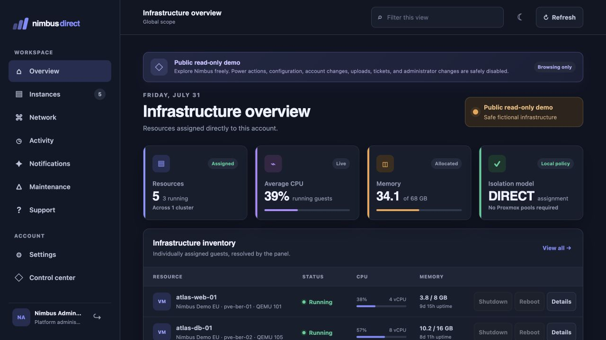

<p align="center">
  
</p>

# Nimbus Direct

Nimbus Direct is a modern, self-hosted customer control panel for Proxmox VE. Administrators assign individual QEMU virtual machines and LXC containers to customer accounts in Nimbus's own database.

**No per-customer Proxmox resource pools are created or required. No agent, daemon, package, or custom software is installed on Proxmox nodes. Customers never receive Proxmox credentials.**

## What is included

- Administrator control center for clusters, customers, users, inventory, direct assignments, permissions, and audit logs.
- Administrator Operations Center with cluster reachability, node pressure, storage capacity, failed/stuck tasks, stale assignments, persistent incident history, and acknowledgement.
- Targeted Maintenance Center for planned work and service incidents, with drafts, scheduling, assignment-derived audiences, frozen per-user deliveries, customer banners/history, resolution, and optional branded email.
- Tenant-safe Support Ticket Center with customer conversations, optional assigned-resource context, administrator ownership/status/priority controls, private internal notes, per-login unread state, audit history, and branded email updates.
- Customer dashboard scoped to active local assignments.
- Start, stop, shutdown, reboot, reset, suspend, and resume permission model.
- Server-side ownership and permission validation before every Proxmox call.
- Full QEMU/LXC detail workspace with status-aware controls, CPU/RAM/storage, uptime, safe configuration, network addresses, and Proxmox RRD history.
- Live customer-safe Proxmox task progress, completion feedback, duplicate-action prevention, and recent per-resource tasks.
- Snapshot Center with live inventory, per-assignment limits, create/restore/delete confirmations, task tracking, and audit history.
- Customer-owned QEMU ISO libraries with direct-to-Proxmox streaming upload, per-customer quotas, mount/eject controls, optional deletion, and server-side ownership validation.
- Guarded one-time ISO boot that saves the exact existing QEMU boot setting, boots only the verified mounted ISO first, and restores the previous order after a tracked power task.
- Administrator Email Center with encrypted SMTP credentials, enforced TLS/STARTTLS verification, connection and delivery tests, a durable retry queue, and sanitized delivery history.
- Private customer Notification Center with unread state, per-login in-panel/email preferences, action results, infrastructure alerts, and recovery notices.
- Per-assignment offline, CPU, memory, and storage alert policies with sustained-duration checks, cooldowns, first-seen baselining, and intentional power-off suppression.
- Authenticator-app two-factor authentication with QR enrollment, one-use recovery codes, short-lived login challenges, active-session review/revocation, administrator-assisted reset, and security email notices.
- Administrator Security & Access Center with MFA coverage, account posture, active-session totals, failed/successful login counts, focused security events, enforceable administrator/customer 2FA policies, and optional successful-login email alerts.
- Mobile-ready Nimbus API v1 with short-lived bearer access tokens, single-use rotating refresh tokens, device-session review/revocation, refresh-reuse detection, existing 2FA support, and a built-in OpenAPI 3.1 contract.
- User-managed integration API keys with administrator-defined grouped permission ceilings, per-key VM/LXC allowlists, expiry and active-key limits, one-time secret display, live effective-action previews, hash-only storage, immediate revocation, and assignment-aware authorization on every request.
- Passwordless administrator-issued invitations and self-service password recovery with 30-minute single-use links, hashed token storage, resend/revoke controls, non-enumerating responses, and session revocation after reset.
- Selected configuration and a short-lived hybrid console gateway: termproxy/xterm.js for LXC and serial-display QEMU guests, with noVNC retained for graphical QEMU guests.
- Encrypted Proxmox token, SMTP password, and queued email-content storage with AES-256-GCM.
- Scrypt passwords, encrypted TOTP secrets, opaque sessions, CSRF/origin checks, rate limits, security headers, and audit records.
- Background resource synchronization that preserves assignments during Proxmox failures.
- Docker deployment with a read-only, unprivileged container.
- Interactive and public read-only demo modes with automated isolation/security/integration tests.
- Persistent System, Light, and Dark appearance modes across sign-in, customer, and administrator screens.

The complete design—including schema, authorization sequence, API endpoints, least-privilege guidance, and phased MVP plan—is in [docs/ARCHITECTURE.md](docs/ARCHITECTURE.md). The mobile/client contract, examples, token lifecycle, and route catalog are in [docs/API.md](docs/API.md).

## Requirements

- Docker with Compose, or Node.js 24+ for local development.
- Proxmox VE reachable over HTTPS from the Nimbus container.
- One privilege-separated Proxmox API token per configured cluster.
- A valid TLS certificate or private CA supplied to the container. TLS verification must not be disabled.

## Quick demo

```bash
cp .env.example .env
```

Set a unique `APP_SECRET`, the bootstrap passwords, and keep `ALLOW_DEMO_DATA=true`. Then:

```bash
docker compose \
  -f compose.yaml \
  -f compose.internal.yaml \
  run --rm panel node scripts/setup.mjs

docker compose \
  -f compose.yaml \
  -f compose.internal.yaml \
  up -d --build --force-recreate panel
```

Open `http://127.0.0.1:4173`. The demo creates five simulated resources across several nodes and directly assigns three to the first customer. Remove the bootstrap passwords from `.env` after setup.

## Public read-only demo

Use a separate Nimbus installation and a fresh Docker volume. Do not copy a live
Nimbus database into the public instance. Configure:

```env
ALLOW_DEMO_DATA=true
DEMO_READ_ONLY=true

BOOTSTRAP_ADMIN_EMAIL=admin-demo@example.com
BOOTSTRAP_ADMIN_PASSWORD=choose-a-shared-demo-password
BOOTSTRAP_CUSTOMER_ID=demo-customer
BOOTSTRAP_CUSTOMER_NAME=Nimbus Demo Customer
BOOTSTRAP_CUSTOMER_EMAIL=customer-demo@example.com
BOOTSTRAP_CUSTOMER_PASSWORD=choose-another-shared-demo-password
BOOTSTRAP_CUSTOMER_DISPLAY_NAME=Demo Customer
```

Initialize and deploy with the same two Compose files:

```bash
docker compose \
  -f compose.yaml \
  -f compose.internal.yaml \
  run --rm panel node scripts/setup.mjs

docker compose \
  -f compose.yaml \
  -f compose.internal.yaml \
  up -d --build --force-recreate panel
```

In this mode, sign-in, sign-out, browsing, filtering, refreshes, resource details,
usage history, network information, support history, and administrator tabs
remain available. Every other `POST`, `PUT`, `PATCH`, and `DELETE` API request is
rejected centrally with `403 demo_read_only`, including power actions, console
tickets, snapshots, ISO changes, support replies, account/security changes, and
all administrator mutations. The interface labels the instance as read-only and
disables those controls.

Nimbus also refuses to start this mode if the database contains a non-demo
Proxmox cluster or stored SMTP configuration. Background synchronization,
maintenance advancement, and email delivery are stopped. Use the interactive
demo instead by leaving `DEMO_READ_ONLY=false`.

Mode combinations:

| `ALLOW_DEMO_DATA` | `DEMO_READ_ONLY` | Result |
| --- | --- | --- |
| `false` | `false` | Normal live panel |
| `true` | `false` | Interactive simulated demo |
| `true` | `true` | Public read-only demo |
| `false` | `true` | Invalid; Nimbus refuses startup |

## Production setup

### 1. Configure Nimbus

Copy `.env.example` to `.env` and set at minimum:

```env
NODE_ENV=production
APP_SECRET=generate-a-unique-random-secret-of-at-least-32-characters
SESSION_COOKIE_SECURE=true
TRUST_PROXY=true
API_ACCESS_TOKEN_MINUTES=15
API_REFRESH_TOKEN_DAYS=30
API_MAX_DEVICE_SESSIONS=10
ALLOW_DEMO_DATA=false
DEMO_READ_ONLY=false

BOOTSTRAP_ADMIN_EMAIL=admin@example.com
BOOTSTRAP_ADMIN_PASSWORD=use-a-unique-password-of-at-least-12-characters
```

Generate the application secret with a password manager or:

```bash
openssl rand -base64 48
```

The secret protects session, challenge, invitation, password-reset, and recovery-code hashes, and encrypts stored Proxmox token secrets, TOTP secrets, SMTP credentials, and queued email content. Back it up in a secrets manager. Changing it invalidates sessions and account links and makes existing encrypted credentials unreadable until rotated.

### 2. Create a least-privilege Proxmox service account

Create a dedicated Proxmox user and privilege-separated API token. Enable only the features needed in Nimbus.

A practical role for status, usage, power, and console access is:

```text
VM.Audit VM.PowerMgmt VM.Console
```

Add only the permissions required by enabled optional features:

```text
VM.Snapshot VM.Snapshot.Rollback
VM.Config.CPU VM.Config.Memory VM.Config.Options
VM.GuestAgent.Audit
Sys.Audit
Datastore.Audit
```

Apply the custom role to `/vms` when Nimbus should discover and manage all guests, or to explicit `/vms/{vmid}` paths for a smaller allowlist. Apply the intended role to both the backing user and the privilege-separated token so the token remains the intersection of both ACLs.

Do not grant `Administrator`, `Sys.Modify`, user management, host-shell access, or unrelated configuration permissions. Beyond the read-only `Datastore.Audit` used for selected Operations Center capacity telemetry, storage mutation privileges are not needed unless the ISO feature is enabled as described below.

`Sys.Audit` enables node CPU, memory, uptime, and root-storage health in the Operations Center. `Datastore.Audit` enables capacity monitoring only for storage paths where it is granted. Nimbus treats these telemetry reads as optional: missing permission is shown as partial coverage and cannot erase the last good reading or break normal VM/LXC synchronization.

`VM.GuestAgent.Audit` lets Nimbus retrieve live QEMU addresses and filesystem usage through the official Guest Agent API. Nimbus filters temporary, pseudo, read-only image, and duplicate mounts before totaling persistent filesystems, and preserves the last valid usage reading while a VM is stopped or the Guest Agent is temporarily unavailable. It falls back to static Cloud-Init `ipconfig` values for QEMU and static LXC network configuration when live address discovery is unavailable. A QEMU VM without a running Guest Agent cannot expose its in-guest filesystem usage through Proxmox, so Nimbus reports the metric as unavailable instead of presenting `0 GB` as real usage. Nimbus does not install an agent on the Proxmox node or inside a guest; it only reads an already configured QEMU Guest Agent through the official Proxmox API.

### 3. Initialize and start

```bash
docker compose \
  -f compose.yaml \
  -f compose.internal.yaml \
  build --pull panel

docker compose \
  -f compose.yaml \
  -f compose.internal.yaml \
  run --rm panel node scripts/setup.mjs
```

Remove `BOOTSTRAP_ADMIN_PASSWORD` and any customer bootstrap passwords from `.env`, then:

```bash
docker compose \
  -f compose.yaml \
  -f compose.internal.yaml \
  up -d --build --force-recreate panel

docker compose -f compose.yaml -f compose.internal.yaml ps
docker compose -f compose.yaml -f compose.internal.yaml logs --tail=100 panel
```

Put an HTTPS reverse proxy in front of Nimbus. Docker Compose publishes port `4173` on all host interfaces so it is reachable across internal/external host networking; restrict access to the reverse proxy or trusted networks with the host firewall. Preserve `Host`, `X-Forwarded-For`, and `X-Forwarded-Proto`.

For this internal-address deployment, always include both Compose files. Starting only `compose.yaml` omits the internal Proxmox hostname/address and private-CA wiring and can make resource-detail API requests fail.

### 4. Add Proxmox clusters

Sign in as the platform administrator and open **Control center → Clusters**.

For each cluster, enter:

- A local cluster ID and display name.
- The certificate-matching API URL, for example `https://pve.example.com:8006`.
- The API token ID, for example `nimbus@pve!panel`.
- The token secret.

Nimbus encrypts the token secret before writing it to SQLite. Test the connection, then synchronize the inventory.

### 5. Assign resources directly

1. Create a customer in **Control center → Customers**.
2. Create the customer's Nimbus user in **Control center → Users**. With email configured, Nimbus sends a private invitation so the customer chooses their own password.
3. Open **Control center → Inventory**.
4. Choose any QEMU VM or LXC container from any configured cluster or node.
5. Select the customer and allowed operations.
6. Save.

The assignment is effective immediately. Reassignment and removal update Nimbus only; Proxmox pools are untouched.

### 6. Enable customer snapshots (optional)

The Proxmox user and privilege-separated API token need these privileges on the managed VM paths:

```text
VM.Snapshot VM.Snapshot.Rollback
```

Then open **Control center → Inventory → Policy** for a QEMU VM or LXC container:

1. Enable any combination of **Create snapshots**, **Restore snapshots**, and **Delete snapshots**.
2. Set **Maximum snapshots** between 1 and 50.
3. Save the assignment policy.

The customer will see **Snapshot Center** on the instance details page. Snapshot creation, restoration, and deletion use the same customer/resource/permission lookup as power controls. Restore and delete require the exact snapshot name as confirmation. Nimbus tracks the Proxmox UPID until completion and temporarily blocks overlapping resource operations.

Snapshot creation and restoration are blocked while a customer ISO is mounted or a one-time ISO boot is active, preventing the temporary CD-ROM or boot state from being captured or overwritten. Snapshots share the guest's storage and are not a substitute for an independent backup.

### 7. Enable customer ISO media (optional)

ISO media is available for QEMU virtual machines only. In Proxmox, enable `iso` content on the intended file-based storage. Add these narrowly scoped privileges to the Nimbus service account:

```text
# On the managed VM paths:
VM.Config.CDROM VM.Config.Options

# On /storage/{storage-id}:
Datastore.Audit Datastore.AllocateTemplate
```

`Datastore.AllocateTemplate` permits ISO upload. Keep customer deletion disabled unless it is genuinely required. Proxmox currently requires the broader `Datastore.Allocate` privilege to delete an ISO volume; that privilege can also affect other storage content. If deletion is enabled, grant it only on the specific ISO storage.

Then:

1. Open **Control center → ISO storage**.
2. Select a cluster and choose **Discover ISO storage**.
3. Enable a discovered storage and set the per-file maximum and per-customer quota.
4. Open **Control center → Inventory → Policy** for a QEMU VM.
5. Enable **View installation media**, **Upload ISO images**, **Mount and eject ISO images**, and **Boot from mounted ISO once**. Enable deletion only when the storage policy and Proxmox ACL intentionally allow it.

Customers will see **Installation media** on the VM detail page. Uploaded bytes stream through Nimbus directly into the official Proxmox upload endpoint; the Nimbus data volume stores ownership, quota, task, and audit metadata but not a second ISO file.

To start an installer, the customer mounts an owned ISO and selects **Boot ISO once**. Nimbus saves the exact current `boot` value, prepends the server-verified CD/DVD slot, and restores the saved value after the next successful Nimbus-tracked start, reboot, or reset task. **Cancel** restores it without booting, and **Restore & eject** restores it before removing the disc. If the boot order changes outside Nimbus, restoration fails closed rather than overwriting the external change.

For Nginx, disable request buffering on the Nimbus proxy and size the body/timeouts for your configured maximum, for example:

```nginx
client_max_body_size 9g;
proxy_request_buffering off;
proxy_read_timeout 2h;
proxy_send_timeout 2h;
```

If another proxy or Cloudflare sits in front of Nimbus, its request-size and timeout limits must also allow the configured ISO size. Use a protected direct/internal Nimbus route for large uploads if that proxy cannot accept them.

### 8. Configure email delivery

Open **Control center → Email** and enter:

- The SMTP hostname without `https://` or another URL scheme.
- Port `587` with STARTTLS, or port `465` with implicit TLS, according to your mail provider.
- The SMTP username and password when authentication is required.
- A sender name/address and optional reply-to address.
- The exact public HTTPS panel URL customers open, for example `https://panel.example.com`.

Save the settings, run **Test connection**, and then send a test message to your administrator address. Connection tests check DNS, certificate validation, STARTTLS support, and authentication without sending mail. A test message creates a real delivery record and confirms the complete queue and SMTP workflow. Tests can run while normal queued delivery is disabled.

Connection checks and test messages have separate safety limits. Saving corrected SMTP settings clears the connection-check limit immediately, so setup mistakes do not force an administrator to wait before retesting.

Nimbus does not offer plaintext SMTP or a “skip certificate verification” switch. The Docker host/container must be able to resolve and reach the SMTP endpoint. SMTP configuration is independent of Proxmox and requires no additional Proxmox role or ACL.

The SMTP password is encrypted before it enters SQLite and is never read back into the browser. Pending email bodies are encrypted as well; after successful delivery, Nimbus removes the stored body and retains only operational metadata such as recipient, subject, status, attempts, and timestamps.

The public panel URL is required only for invitations and password recovery. It does not change how Nimbus reaches Proxmox. Use the customer-facing HTTPS URL through your reverse proxy or Cloudflare Zero Trust, without a query string or fragment.

### 9. Enable notifications and resource alerts

No additional Proxmox permission is required. Alert evaluation uses status and usage metadata already returned by the normal resource synchronization.

1. Open **Control center → Inventory → Policy** for an assigned resource.
2. Under **Notifications & alerts**, enable alerting and choose offline, CPU, memory, and/or storage conditions.
3. Set the percentage thresholds, the time a condition must remain active, and the repeat cooldown.
4. Save the assignment policy.
5. Each customer login opens **Notifications** and chooses its own in-panel and email delivery preferences.

Email is opt-in for every customer login. A customer can enable the preference before SMTP is active; delivery begins once an administrator enables the Email Center. In-panel notifications stay private to that specific login, while administrators see the platform-wide event history in **Control center → Alerts**.

Nimbus evaluates thresholds only after a successful Proxmox synchronization. A failed API request therefore cannot generate a false outage alert. An already-stopped guest is baselined silently when alerting starts, and a recent Nimbus stop or shutdown request suppresses the corresponding offline alert. A sustained incident generates one alert, and returning to normal generates one recovery notice; Nimbus does not send the same message on every synchronization cycle.

### 10. Enable two-factor authentication

Two-factor authentication is a Nimbus account feature and requires no additional Proxmox permission.

1. Sign in and open **Settings**.
2. Under **Two-factor authentication**, enter the current Nimbus password.
3. Scan the QR code with a TOTP-compatible authenticator app, or enter the displayed setup key manually.
4. Enter the current six-digit code.
5. Save the ten recovery codes immediately. Nimbus shows them only once.

Future logins require the password plus either a current authenticator code or one unused recovery code. Each recovery code is invalidated as soon as it is used. Generating a new set invalidates the entire previous set.

The same Settings page lists active sessions with their last-seen time, IP address, and browser/platform summary. Users can revoke one device or re-enter their password to revoke every other session. Enabling or disabling 2FA also signs out every other device.

Administrators can see whether 2FA is enabled in **Control center → Users**. If a user loses both the authenticator and recovery codes, an administrator can edit that user and perform a password-confirmed 2FA reset. This signs the affected user out everywhere and sends a security email when SMTP delivery is enabled. Administrators must use their own Settings page for self-service disablement; the assisted-reset route cannot reset the currently signed-in administrator.

Open **Control center → Security** to review MFA coverage, accounts still requiring enrollment, active-session totals, successful and failed login activity, and a focused security-event timeline with account and source-IP context. Failed password attempts are recorded without storing the guessed email address for unknown accounts.

Security policies default to off, so deploying the release cannot lock out the current administrator. You can independently require 2FA for administrators and customers. When a protected group policy is enabled, an account without 2FA receives a restricted session that can access only the enrollment screen; resources, customer data, and administrative APIs remain unavailable until setup is confirmed. Required 2FA cannot be disabled while the policy applies. Enable 2FA for administrators first, store the recovery codes safely, and then enforce the administrator policy.

The same Security tab can enable an email after every successful sign-in. These account-security emails, password-change notices, and administrator-reset notices use the Email Center and do not contain passwords or Proxmox credentials. They are unavailable until SMTP delivery is enabled.

### 11. Invite users and recover passwords

Account links are a Nimbus feature and require no additional Proxmox permission.

1. Configure and enable SMTP delivery, including the public panel URL, in **Control center → Email**.
2. Open **Control center → Users**, choose **Email secure invitation**, and create the user.
3. Nimbus emails a 30-minute, single-use link. The customer chooses a private password; administrators never need to know or transmit it.
4. Pending, expired, or revoked onboarding is visible in the Users table. **Resend invite** invalidates the prior link. **Revoke link** keeps the user record but disables the current link.

The sign-in page now includes **Forgot your password?**. Nimbus always shows the same response whether the submitted address exists, is disabled, or cannot use recovery. Eligible accounts receive a 30-minute, single-use reset link. Completing the reset revokes every active session but preserves configured 2FA, so the next sign-in still requires the authenticator or a recovery code.

Only an `APP_SECRET`-keyed hash of each account token is stored in `account_tokens`. The raw token exists only in the encrypted queued email until delivery and in the link received by the user. The browser removes it from the address bar before validation, API logs omit query strings, requests are rate-limited, and every request/completion/resend/revoke action is audited.

### 12. Use the Operations Center

Open **Control center → Operations** as an administrator. Nimbus updates health telemetry during the normal Proxmox synchronization cycle and exposes a rate-limited **Run full health refresh** action when an immediate check is needed.

The center monitors:

- Cluster reachability and stale/never-completed synchronization.
- Node online state, CPU pressure, memory pressure, root-storage usage, and uptime.
- Proxmox storage availability and percentage capacity.
- Assigned resources missing from the latest successful inventory without deleting their local assignments.
- Incomplete tasks that exceed 15 minutes and failed tasks from the last 24 hours.

Conditions open persistent administrator-only incidents. Acknowledging an incident records the administrator and timestamp but does not disable monitoring. Nimbus resolves it automatically when a later successful reading returns to normal and keeps the recent recovery in the center.

Optional node and storage requests are isolated from the primary inventory request. If `Sys.Audit` or `Datastore.Audit` is missing, the center shows partial telemetry coverage and retains its last good metrics. No Operations Center route is available to customer accounts.

### 13. Publish maintenance and incident notices

The Maintenance Center is a Nimbus-only feature and requires no additional Proxmox permission.

1. Open **Control center → Maintenance**.
2. Choose **Planned maintenance** or **Service incident**, enter the customer-facing title/message, severity, start time, and optional end time.
3. Target all customers, one or more clusters, nodes, assigned resources, or customer accounts.
4. Publish immediately or save an editable administrator-only draft.
5. Resolve active work when complete, or cancel a scheduled window that will no longer happen.

At publication, Nimbus resolves the selected infrastructure through its own active assignment database and creates an immutable delivery for each currently affected active customer user. Reassigning a VM later cannot expose the old notice to its new customer. Drafts have no deliveries and are never visible outside the administrator control center.

Affected users see active/upcoming notices on the dashboard and a complete private timeline under **Maintenance**. Read state is scoped to the individual login. When Email Center delivery is enabled and the notice requests email, Nimbus queues the branded message only for users who opted into email infrastructure notices. Resolving a notice can likewise queue a recovery email for users who enabled recovery messages. In-panel maintenance remains visible even when email is disabled.

### 14. Use the Support Ticket Center

The ticket center is stored entirely in Nimbus and requires no additional Proxmox permission.

1. A customer opens **Support → New ticket**, chooses a category and priority, optionally links one of its assigned servers, and writes the initial message.
2. Nimbus verifies the customer and active resource assignment server-side before creating the ticket. A changed or foreign resource ID returns the same customer-safe not-found response.
3. Administrators open **Support** to see the global queue, assign an active administrator, change priority/status, send customer-visible replies, or add an internal note.
4. Customer replies place the ticket in **Waiting for support**; administrator replies place it in **Waiting for customer**. Resolved or closed tickets must be reopened before another public reply.
5. Customers may close and later reopen their own customer-scoped tickets. Every action is CSRF-protected, rate-limited where appropriate, and audited without copying message contents into the audit log.

All active users belonging to the same customer account can see that customer's tickets, which supports teams without exposing another customer. Unread state remains individual to each login. Internal notes and their count are visible only to administrators. When Email Center delivery is enabled, ticket creation notifies the assigned administrator—or all active administrators when unassigned—and administrator replies/status changes notify active users in the affected customer. Emails link back to the private Nimbus thread and never include Proxmox credentials.

### 15. Use the Nimbus API

Nimbus publishes its stable API discovery document at `GET /api/v1` and its
OpenAPI 3.1 contract at `GET /api/v1/openapi.json`. Native clients authenticate
through `/api/v1/auth/token`, complete the existing 2FA flow when required, and
use short-lived bearer access tokens plus single-use rotating refresh tokens.

All existing customer assignment, permission, resource-state, rate-limit, task,
and audit checks remain server-side. The mobile app never receives a Proxmox
credential and cannot supply Proxmox coordinates for an action. Administrator
sessions receive effective control permissions for every currently discovered
VM and container, including guests that are not assigned to a customer.
Customer sessions remain limited to their live direct assignments.
Administrator operations are also available through the versioned
`/api/v1/admin/...` namespace.

See [docs/API.md](docs/API.md) for the complete token lifecycle, secure mobile
storage requirements, examples, route families, error model, and deployment
notes. The API itself requires no additional Proxmox privilege; it can invoke
only the features already granted to Nimbus's central service account.

## Internal Proxmox addresses and private CAs

Keep the TLS certificate hostname in the cluster API URL. To resolve it to an internal address only inside the container, configure the variables at the end of `.env.example` and use:

```bash
docker compose \
  -f compose.yaml \
  -f compose.internal.yaml \
  up -d --build --force-recreate panel
```

Mount only the public CA certificate. Never copy a private CA key into Nimbus and never disable TLS verification.

## Data, backups, and upgrades

SQLite data is stored in the `nimbus-data` volume. Stop Nimbus before copying it, or use a SQLite-aware backup process. Back up both the database and `APP_SECRET`, store them separately, and test restoration.

The numbered schema is in `migrations/001_initial.sql`, with additive task indexes in `migrations/002_task_tracking_indexes.sql`, ISO ownership/policy tables in `migrations/003_iso_media.sql`, one-time boot restoration state in `migrations/004_iso_boot_once.sql`, the per-assignment snapshot limit in `migrations/005_snapshot_policy.sql`, SMTP/queue tables in `migrations/006_email_delivery.sql`, notification/alert state in `migrations/007_notifications.sql`, MFA/session metadata in `migrations/008_mfa_sessions.sql`, account invitation/recovery state in `migrations/009_account_lifecycle.sql`, Operations Center telemetry/incidents in `migrations/010_operations_center.sql`, targeted maintenance notices/deliveries in `migrations/011_maintenance_system.sql`, customer-scoped support conversations/read state in `migrations/012_support_ticket_center.sql`, durable Security & Access Center policy/index state in `migrations/013_security_access_center.sql`, native Nimbus API device/refresh-token state in `migrations/014_nimbus_api.sql`, administrator-governed user integration keys in `migrations/015_user_api_keys.sql`, and encrypted native push-device registrations in `migrations/016_mobile_push.sql`. Runtime startup creates the new tables and adds legacy columns automatically, so this release does not require a manual migration command. Take a database backup before every update.

## Operations

- `GET /api/health`: liveness.
- `GET /api/ready`: initial setup status.
- JSON logs are written to stdout/stderr.
- Inventory synchronization defaults to 60 seconds (`RESOURCE_SYNC_SECONDS`).
- Guests missing from a successful Proxmox inventory are marked stale and immediately excluded from active inventories, customer dashboards, API-key resource lists, counts, and action authorization. Their local assignments remain preserved for outage safety and are restored only if the same cluster/type/VMID identity returns. A failed Proxmox request never marks an existing guest stale.
- Proxmox tasks are stored using their UPID, but browser APIs return only normalized customer-safe task records. The instance page polls active tasks for immediate feedback, while the server synchronization cycle also completes tasks and notifications when the browser is closed.
- Snapshot limits are stored per assignment and enforced server-side against the current Proxmox snapshot inventory.
- ISO upload ceilings are controlled by `ISO_MAX_UPLOAD_MB` and `ISO_UPLOAD_TIMEOUT_MINUTES`; storage policies can impose lower limits and customer quotas.
- One-time boot restoration is tied to a successful Nimbus-tracked start, reboot, or reset task. If an administrator powers the VM directly in Proxmox instead, use **Cancel** in Nimbus to restore the saved order.
- Email delivery polls its SQLite queue every five seconds by default. Temporary failures retry with increasing delays; authentication, sender, and recipient errors fail without repeated attempts. Adjust only the worker cadence and SMTP timeout with `EMAIL_QUEUE_INTERVAL_SECONDS` and `EMAIL_SMTP_TIMEOUT_SECONDS`.
- Resource alert conditions are evaluated after successful inventory synchronization. Alert policies and incident state survive restarts; assignment removal or reassignment resets incident state.
- Operations telemetry is normalized and stored locally. Optional node/storage permission failures retain the last good readings, while cluster, stale-assignment, and stuck-task incidents continue to evaluate.
- Maintenance audiences are resolved from active local assignments at publication and stored as per-user delivery snapshots. Scheduled notices activate automatically; notices with an end time resolve automatically even when no browser is open.
- Support tickets are customer-account scoped, while unread markers are user scoped. Internal notes never appear in customer queries, email, or customer-visible counts.
- TOTP enrollment windows last ten minutes and pre-authentication login challenges last five minutes. Verification and security-setting changes have independent rate limits.
- Security policy changes are administrator-only, CSRF-protected, rate-limited, and audited. Enforcement is repeated on every request rather than relying on the current page state.
- Invitation and password-reset links last 30 minutes, are single-use, and are invalidated by resending, revocation, successful use, or an administrator-set password.
- Native API access tokens are short lived; refresh tokens rotate after every use. Reuse of an old refresh token revokes that entire device session.
- Integration API key secrets are shown once and stored only as `APP_SECRET`-bound hashes. Their effective groups and resources are intersected with the live administrator policy and direct assignment on every request; keys cannot manage credentials or account security.
- Native APNs registrations require a normal rotating mobile bearer session. Device tokens are encrypted at rest, removed on sign-out, and never accepted from integration API keys.

## Console security

The panel pins noVNC 1.7 and xterm.js 6.0. A console launch checks the local assignment and permission before automatically selecting Proxmox `termproxy` for LXC and serial-display QEMU guests or `vncproxy` for graphical QEMU guests. The resulting ticket is encrypted in a short-lived, single-use Nimbus session. Both clients connect only to a same-origin Nimbus WebSocket URL; Nimbus consumes the local launch token, authenticates the upstream Proxmox `vncwebsocket` upgrade with the encrypted service-account credential, and pipes binary data. The scoped Proxmox ticket and termproxy username are released only to the authenticated, still-authorized console page over HTTPS and held in browser memory for the handshake. Native clients exchange the same 45-second launch token for a path-restricted, HttpOnly console cookie; the normal mobile bearer and refresh token never enter the web view. The long-lived Proxmox API token never reaches the browser or app. Both console types use the existing `VM.Console` privilege.

## Verification

```bash
npm run check
```

The suite verifies credential, TOTP-secret, and queued-content encryption; hashed single-use invitations and password-reset links; non-enumerating recovery responses; account-link revocation and expiry; password-reset session revocation with 2FA preservation; RFC-compatible TOTP generation; one-use recovery codes; MFA login challenges; scoped session revocation; durable security policy, forced-enrollment restriction, required-2FA disablement denial, failed-login events, account posture, and password/login security emails; SMTP message/queue behavior; notification isolation and deduplication; sustained alert/recovery state; maintenance target resolution, immutable recipient snapshots, customer isolation, read state, scheduling, branded email, and administrator/customer routes; support-ticket customer isolation, foreign-resource rejection, unread state, internal-note secrecy, administrator assignment/status workflows, branded email, and API auditing; direct customer/resource/permission authorization; cross-customer denial; tampered-resource denial; assignment preservation across synchronization; token handling; password/session security; Proxmox request mapping; normalized node/storage operations telemetry; partial-permission preservation; incident acknowledgement and automatic resolution; customer denial of Operations Center routes; customer-scoped task/audit access; snapshot normalization/limits/confirmations; ISO ownership/quota isolation; streamed multipart upload; guarded CD-ROM mount/eject behavior; and exact one-time boot-order restoration.

Before serving external customers, complete the Phase 2 hardening work in the architecture document, run a penetration test, validate least-privilege ACLs on your exact Proxmox release, and perform backup/restore drills.
